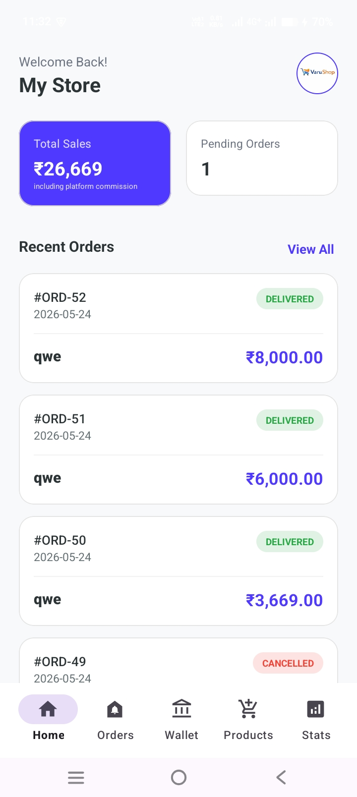
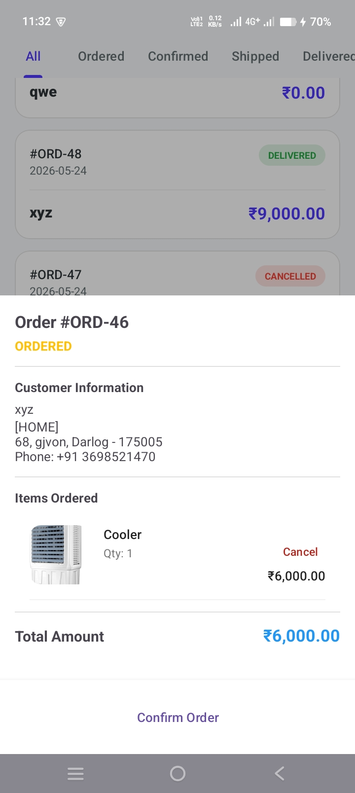
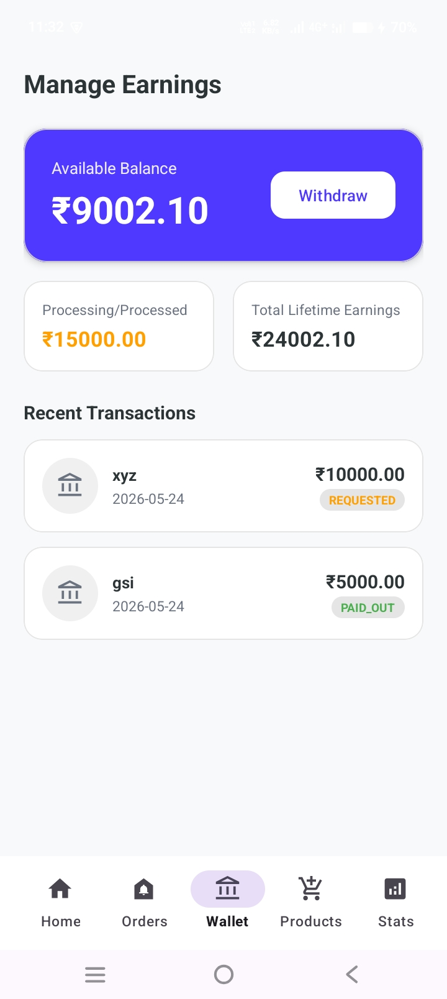
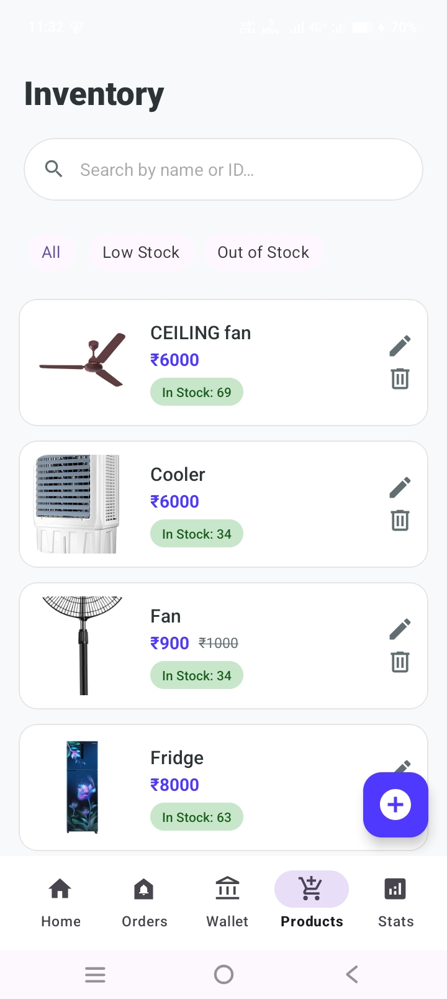
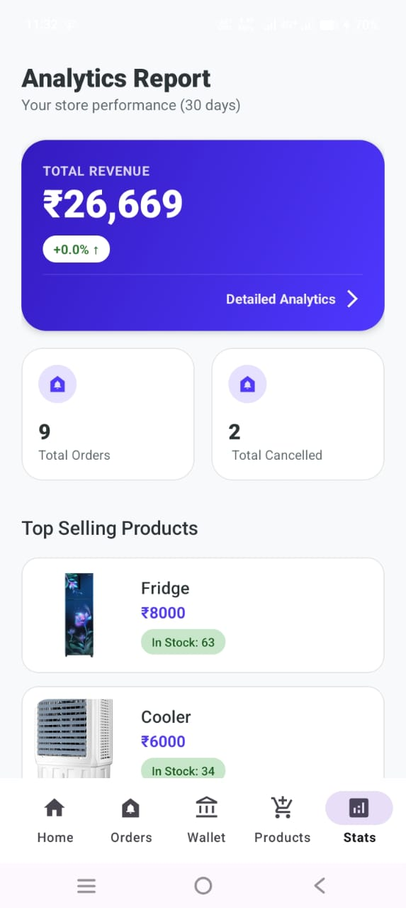
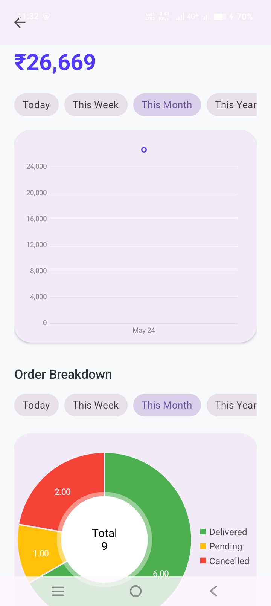

# 🏪 VaruShop Retailer 

## 🚀 Overview
**VaruShop Retailer** is a robust Android application designed for store owners to manage their e-commerce operations. It provides a centralized dashboard to upload products, process incoming orders, track revenue analytics, and manage automated commission-based fund withdrawals.

## ✨ Key Features

### 📦 Product & Inventory Management
* **Upload Products:** Add new items to the store catalog with images, descriptions, and pricing.
* **Manage Inventory:** Edit existing products, update stock availability, and manage product categories.

### 🛒 Advanced Order Processing
* **Real-Time Order Tracking:** View and manage all active, current, and past customer orders.
* **Status Updates:** Seamlessly update order statuses to keep customers informed (`Pending` ➔ `Shipped` ➔ `Out for Delivery` ➔ `Delivered`).

### 💰 Wallet & Payout System
* **Automated Commission Logic:** The app automatically calculates earnings, allowing retailers to withdraw exactly **90%** of their total sales (accounting for the 10% platform/admin commission).
* **Withdrawal Requests:** Securely request payouts for earned income directly from the in-app wallet.

### 📊 Business Analytics
* **Income Dashboard:** View total revenue generated over time.
* **Category-Wise Insights:** Analyze which product categories are selling the most to make informed restocking decisions.

## 🛠 Tech Stack
* **Platform:** Android Studio
* **Language:** Kotlin
* **Backend/Database:** Node.js API
* **Architecture:**  MVVM, ViewBinding

## 🎥 Video Demonstration
Watch the full working demo of the VaruShop Retailer app, including order management and the wallet withdrawal process:


[](https://www.youtube.com/shorts/-6jZzmWfF4A?si=aZUt7kTHP7LpcRTR)


## 📸 Screenshots
<table>
  <tr>
    <td align="center"><a href="#"></a><br>Main Dashboard</td>
    <td align="center"><a href="#"></a><br>Order Status Updates</td>
    <td align="center"><a href="#"></a><br>Wallet</td>
  </tr>
  <tr>
    <td align="center"><a href="#"></a><br>Products Management</td>
    <td align="center"><a href="#"></a><br>Analytics page</td>
    <td align="center"><a href="#"></a><br> Graph</td>
  </tr>
</table>


## 💻 Installation and Setup

1. **Clone the repository:**
```bash
   git clone this Repository

```

2. **Open the project:**
* Launch **Android Studio**.
* Select `File > Open` and choose the cloned project folder.


3. **Connect to Backend :**

4. **Sync Dependencies:**
* Wait for Android Studio to automatically sync the Gradle files.


5. **Run the app:**
* Connect a physical Android device or start an emulator.
* Click the green **Run** button or press `Shift + F10`.

